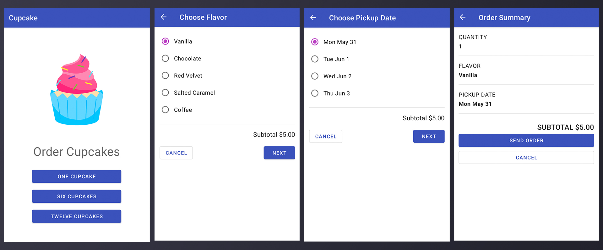

# Cupcake Order

This is a simple food ordering application implementing advanced android concepts

## Components uses

1. Navigation Components
2. ViewModel
3. LiveData
4. View Bindings
5. Two way Bindings

# Screenshots

